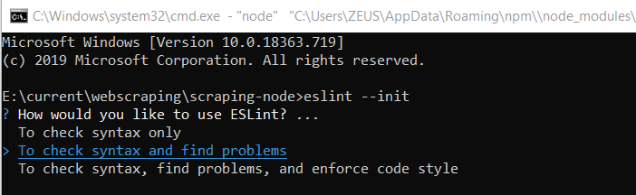
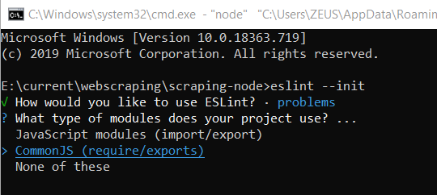
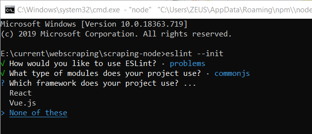
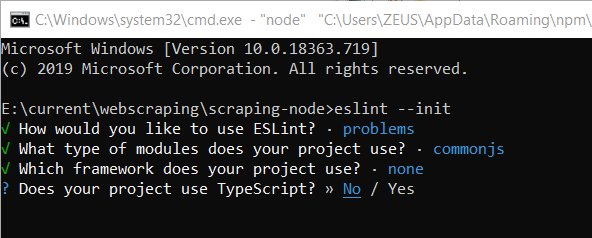
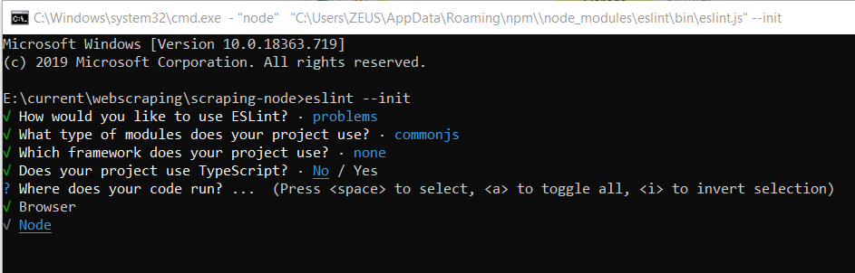
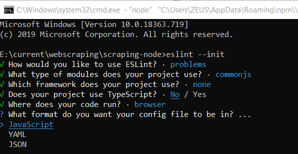

<!--lint disable no-literal-urls-->

<p align="center">
  <a href="https://nodejs.org/">
    
  </a>
</p>

### Disclaimer

Selenium is a browser automation tool. This particular repository only covers Selenium setup for Node.js(Javascript) based programming language.

node.js is very good in web scraping and backend language in web development.

Now node.js is top in web scraping. Of course, In web developing, Node.js and Express.js is also top, but I am explaining web scraping here.

To continue further development with this tool, make sure to read following guide.


### Prerequisites

- [Node](https://nodejs.org/en/download/)
- [Selenium](https://www.npmjs.com/package/selenium-webdriver)

Optional:
- [Chrome WebDriver](https://www.npmjs.com/package/chromedriver#building-and-installing)

Note that you will need to install at least one of the above WebDrivers in the [Installation](#installation) part.

### Installation

1. Once you have all the required prerequisites ready, create your project folder:

```
mkdir node-selenium
cd node-selenium
npm init
npm install cheerio               // cheerio is Node. js library that helps developers interpret and analyze web pages using a jQuery-like syntax.
npm install chromedriver          // The main purpose of the ChromeDriver is to launch Google Chrome.
npm install selenium-webdriver    // Selenium WebDriver is a free, open-source, portable software-testing framework for testing web applications quickly.
npm install -g eslint             // ESLint is an open source JavaScript linting utility that help you overcome developer errors as JavaScript is loosely-typed language. 
```

2. Download our src code, by using one of these commands: 

git clone https://github.com/Venus9023/node-selenium.git

you can download chromdrver.exe from https://www.automationtestinghub.com/download-chrome-driver/

Next, you have to copy this file to node-selenium directory.

3. To run "npm run lint", you have to implement like this.

Now we can use "eslint" command and this make examiner to be able to run standard in the console to see that you have no errors with the command npm run lint.

In the last time: Please input and implement "eslint --init" command in command prompt.

Then you can select in following image files.














4. Usage

command line type: 
  
  npm start <url> // for example: npm start https://courselab.lnu.se/scraper-site-1
                                  npm start https://courselab.lnu.se/scraper-site-2
  
  npm run lint // to see that you have no errors.

You can input npm start <url> in command prompt. Url is server url. So you can expand this project if you want.
You should be able to run standard in the console to see that you have no errors with the command npm run lint.
